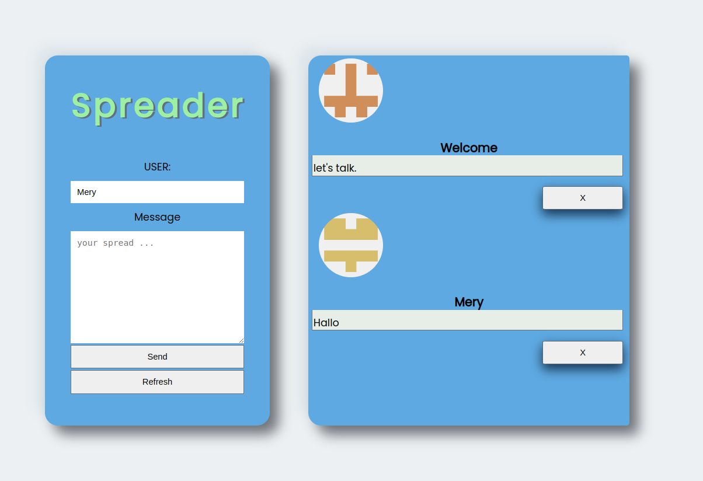

# Spread_Chat_App
Little chat App for our class
# Code Busters Chat

#### Navigation

- About Project
  - _Description_
- How to use this Project
  - _Description_
- Developed With
- Contact
  - _Mail_
  - _GitHub_
  - _LinkedIn_
- Used Tools
  - _Fonts_
  - _Design_
  - _Icons_
  - _Colors_

---

### About Project

Wie soll der Chat aussehen?

- Besprecht in der Gruppe, wie der Chat-Raum aussehen soll
- Es muss einen Bereich geben, wo alle Nachrichten zu sehen sind
- Es muss einen Bereich geben, wo der Nutzer seine Nachricht schreiben kann

- Setzt euer Konzept mit HTML und CSS um.

### How to use this Project

- Der Nutzer soll am Anfang seinen Namen eingeben
- nutze fetch um eine Liste der Nachrichten zu laden und im Chat-Fenster anzuzeigen.

##### Developed With

- [x] _HTML5_
- [x] _CSS3_
- [ ] _SASS_
- [ ] _SCSS_
- [x] _JavaScript_
- [ ] _React_
- [ ] _Bootstrap_
- [x] _npm_
- [ ] _..._

---

### Contact

Mail: <holgeraliusklose@gmail.com> 
GitHub: [Holledrums](https://github.com/holledrums) 
LinkedIn: [Holger Klose](https://www.linkedin.com/in/holger-klose-240831147/)

Mail: <mercedes.girmanova@gmail.com> 
GitHub: [aboutthatmery](https://github.com/aboutthatmery) 
LinkedIn: [Mercedes Girman](https://www.linkedin.com/in/mercedes-girman-2511a4216/)

---

### Used Tools

- [icons](https://)
- [Canva](https://www.canva.com/)
- [npm](https://www.npmjs.com/)
- [Google Fonts](https://fonts.google.com/)
- [Visual Studio Code](https://code.visualstudio.com/)
- [ColorZilla](https://www.colorzilla.com/chrome/)

---

Made with ❤️ by us!
